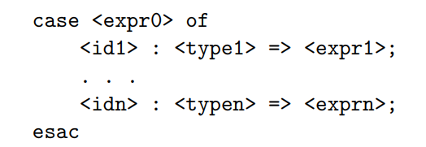
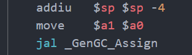

> Surely all this is not without meaning.


<p style="text-align: right">—— HERMAN MELVILLE, Moby-Dick, 1851 </p>


> 虽然题目起得很大，但是内容也只涉及了编译器实现的一小部分，主要还是一些自己对编译器high level的认识，加上部分cs143实验的总结。


# 什么是编译器

一个编程语言可以看作一个从它的合法程序集合到运行时行为的total function，设为`f`。我们编程则是已知运行时行为b，求解出一个合法程序`a`以使得`f(a)=b`的过程。函数`f`一般都为可计算函数，且`f`对应的计算规则也是比较特殊以使得我们也较易掌握的，具体而言，就是可以采用模块化，分而治之这样的思想来构造出`a`，这种计算规则常常表现为定义在AST上的求值规则(如opretional semantic)。

> 确定合法程序的集合的规则一般被称为 syntax
>
> 而total function `f` 一般被称为 semantics

有一部分的编程语言`u`被称为unsafe的，因为`codom(u)`往往含有一些我们——编程人员觉得不好的行为。比如该行为取决于目标代码所运行的机器，或是产生该行为的计算规则十分特殊(比如说数组越界不报错而是返回42)。而相应的，`codom(u)`均是好的行为的编程语言我们称为safe的编程语言。safe语言的例子有java，而c则是一个unsafe的语言。不过在实际编写代码，尤其是系统软件中，就算是safe的语言也往往会进行一些扩展，以允许编写一些与具体机器有关的unsafe操作。

当然编程语言仅仅定义为total function还是不够的，要想让编程语言不仅仅是我们脑海中的方程，我们还需要让机器去运行它。但机器有着自己的语言，我们必须把编程语言翻译为机器语言才可以让机器去运行。我们把机器的语言称为目标语言，其一段程序称为目标代码，而我们的编程语言称为源语言，其一段程序称为源代码。由于目标代码是可以被机器运行并表现出运行时行为，我们也可以把一个编程语言f的值域看作是目标代码的集合。f在计算机上的实现就称作编译器。

但是由于合法程序只是所有字符串的一个子集，而我们可以给编译器输入任何字符串，因此编译器必须还有错误程序检测的功能。因此，我们使用的编译器的一般都会有两项功能，其一是代码形式的转换，其二是拒绝错误的程序。因此我们可以把编译器看作从源代码到目标代码的partial function。

# 编译器的结构

编译器可以被分为几个相互独立的部分，分别实现，然后用管道组合起来。CS143中cool的实现也是如此：该实验的最后你会获得lexer，parser，semant，cgen四个可执行文件，可以用如下shell脚本组合起来得到一个完整的编译器`./lexer $* | ./parser $* | ./semant $* | ./cgen $*`。其中 lexer，parser 对应的是语法分析阶段，semant对应的是语义分析阶段，而cgen对应的是代码生成阶段。

除cgen/代码生成之外每个部分/阶段都有两项任务，一是**检查并拒绝错误的程序**，二是**进行代码形式的转换**。而cgen只有进行代码形式的转换一个任务，因为在cool以及大部分编译器的设计中，代码生成阶段都假定输入已经是合法的程序。

每一阶段的工作可以看作一个数学函数f(X->Y)，定义域X为该阶段能处理的输入,Y为可能的输出的集合。假如lexer，parser，semant，cgen都看作数学函数，则compiler =  cgen ∘ semant ∘ parser ∘ lexer。具体来说，

```
dom(lexer) = {文本程序}         codom(lexer) = {token流}
dom(parser) = {token流}         codom(lexer) = {语法树}
dom(semant) = {语法树}          codom(lexer) = {装饰后的语法树(主要指添加类型信息)}
dom(lexer) = {装饰后的语法树}    codom(lexer) = {目标代码}
```

但是，值得注意的是，这里的函数都是 **partial function，**即并非每个定义域的值都有陪域的值与之对应，这些值就代表这编译过程的发现的错误程序，编译器会报错并提示用户修改。

之所以一个compiler要被拆分为几个独立的部分，是因为这些部分的功能都相当内聚，互相之间联系较少。从错误处理的角度来看，lexer是用`正则表达式`排除错误程序，而parser是用`CFG`排除错误程序，semant做的事情则比较复杂，采用了多种技术来排除掉错误程序，并输出合法程序。

> 我们又常常说  由 lexer 和 parser 定义了语法规则，通过lexer和parser检查的是满足语法规则的程序，这个阶段所以被称为语法分析阶段
>
> semant定义了静态语义规则，通过semant检查的是满足静态语义规则的程序，这个阶段所以被称为语义分析阶段。

# 语义分析阶段的任务

因此，semant做的事被称为语义分析，它会做许多检查：比如说检查标识符必须先声明再使用，类继承图必须无环之类的。但是语义分析阶段做的最重要的一件事则是类型检查，其目的是检查程序满足type rules，而type rule即是type system的主要组成部分。不过类型检查也不必非得在语义分析阶段做，有的语言也将类型检查纳入运行时，具体类型系统做了什么样的检查，这还得要从编程语言的求值规则说起。

编程语言写成的程序虽然是字符串，但这个字符串却实际上表示了一种树型结构，我们把这个树型结构叫做对应字符串的语法树。为什么要用树型结构？因为树型结构的表达能力足够强，也是易于理解的。我们所能构建的大部分复杂事物往往都只采用了组合和抽象两种手段。组合即是将基本的事物放在一起，而抽象指将许多事物忽略其细节，只关注其整体作用。如在Scheme中，基本的元素就是整数字面量，而组合的方法则有`+, -, *, /`等运算，而抽象则是函数。

> 一般来说，语法分析阶段只负责保证程序确实表达了一个树型结构即可
>
> 剩下的检查都是语义分析的任务了

但并非任意种类元素都能组合，抽象，一种运算可能只能组合某种特定类型的元素，比如说 `1 + 2 `就是对的，但是 `1 + "2"`就是不对的(不对指在程序员看来，这是无意义的。假如程序员真的写出了这样的程序，则他会希望编译期或是运行时报错，而非一声不吭执行下去得到一个奇怪的结果)。我们可以给语法树的每个节点都赋予一个类型，并定义类型推导的规则，这些推导规则的集合就叫做该语言的类型系统。

上面说的检查过程就叫做类型检查，检查程序是否满足类型系统的规则，是语义分析中最为重要的一个部分。在程序员眼中，类型检查如果静态能做自然好，但是动态报错也是无妨的——只要不一声不吭地执行就算是好的行为，动态类型检查的语言也可以是safe的。虽然动态进行检查会导致程序运行时错误增多，但是却增加了许多灵活性。

一般在编译器语义分析过程中进行类型检查的语言称为**静态语言**，而动态类型检查的语言称为**动态语言**。

另外我们常常会用到强类型语言与弱类型语言两个词，这两词的含义并未明确定义，而是依赖于语境。一般来说，如果一个语言不会因类型错误而产生unsafe行为，则称为强类型语言，反之则称为弱类型语言。

# 代码生成阶段的任务

通过语义检查的程序都是合法的程序，下一步就应该将合法的程序转化为目标代码了。但值得注意的是，lexer，parser以及semant中也都进行了代码形式的转换，将程序代码从字符流转化为了语法树(可能还伴随着符号表的填充)。和错误处理一样，lexer也是通过`正则表达式`来讲字符串识别为一个个token，parser也是通过`CFG`从token流中构建语法树。而semant只是遍历已建好的语法树并收集信息。lexer和parser合称为语法分析，在许多编译器实现中两个阶段是紧密耦合在一起的，Antlr，Pest等语法分析工具也是同时做了lexer和parser的事情，你只需要向这些工具中输入语言语法的specification，这些工具就会自动生成将字符串转化为语法树的代码。这些语法分析工具背后的理论则涉及形式语言与自动机，可以说是计算机理论在实际软件编写中非常成功的应用了。

与语法分析阶段，代码生成阶段往往没有如此自动化的工具或是普遍性的理论支撑——当然语言的语义是有`operational semantics`,`denotational semantics` 等形式化方法定义的，但是就算是用最贴近实现的`operational semantics` 来指导实现，我们所得到的也只能是一个效率低下的解释器。因为这些形式化的语义定义往往是直接在AST上定义，以AST层面的概念为程序状态，而我们想要的是将AST直接映射到一种低级语言，这往往是需要程序员自己去思考如何实现的。

将高级语言的许多概念，如类，对象的创建，控制流等映射到低级语言的过程在我看来是一件非常神奇的事情。在之前我也曾学过汇编语言，学过一些高级语言，但二者之间如何进行转换确实在我学习编译原理之前万万没有想到的。下面就拿cool举个例子：

```Java
class A {
   method1() : SELF_TYPE { // 1
      self
   };
   method2() : SELF_TYPE  { // 2
      self
   };
};

class B inherits A { 
   method1() : SELF_TYPE {  // 3
      self
   };
   method3() : SELF_TYPE { // 4
      self
   };
};
///////////////////////  5
let b: A in {  
    let a : Int <- rand() in {
        if a % 2 == 0 then {
            b = new A()
        } else {
            b = new B() 
        }    
    }
    b.method1()
}
```

当有一个B类的对象b时，代码中的`b.method1()`会调用3处的方法，并把对象自己绑定到self上，而`b.method2()`则会调用2处方法，`b.method3`自然也会调用4处的方法。到此为止一切似乎还算好实现，每个方法都对应一段代码，要知道一个方法调用究竟对应哪个方法，我们可以先在B类中找该方法，如果找到就生成call这个方法的低级语言代码，如果找不到则到其父类中去找。这样似乎一个call调用哪个方法静态时就已经决定了。

但是考虑5处的代码段，在cool中`b.method1()`会根据b的实际类型来选择到底调用哪个方法。假如运行时发现b是B类对象，则会调用3处方法，否则会调用1处方法。根据运行时状态来决定调用哪段代码？这应该如何实现？初听之可能觉得不可思议，但是看了实现之后却发现又无比自然。

在cool中，一个Class在内存中以这样的形式存储：

首先是有一个`class_objTab`，其中包含了每个类的原型与初始化方法的地址，我们在new一个类时，实际上是将原型拷贝一份，然后调用其初始化方法。而如何获得其原型和初始化方法呢？这就是通过`offset`以及`class_objTab`的地址算出的了。当然了，对于初始化方法和原型对象，我们也可以不通过查`class_objTab`表而直接得到其地址。

而每一个类原型，也就是`XXX_protObj`，都包含以下几部分：`{classTag ObjectSize DispatchTablePointer}`，其中`classTag`表明其在`class_objTab`中的位置，而`ObjectSize`表示其大小(如果类含有成员变量自然size就会增大了)，`DispatchTablePointer`指向一个包含许多方法的表，这个表在c++中的对应被称为虚函数表。

当我们生成调用`b.method1()`的代码时，我们不需要知道`method1`的实际地址，我们只要知道该对象指向的虚函数表中的第几位对应名为`method1`的方法就行了。如下面代码所示，在继承关系中重载时会直接将父类同名方法覆盖，因此对于`method1`，无论b是B类还是A类对象，它们需要调用的`method1`都在各自对象的虚函数表的相同位置，这样就实现了调用哪个方法的动态决定，也就是Java中所说的动态绑定。

```Assembly
class_objTab:
    .word   Object_protObj
    .word   Object_init
    .word   A_protObj
    .word   A_init
    .word   B_protObj
    .word   B_init
    ...


A_protObj:
    .word   9
    .word   3
    .word   A_dispTab
    .word   -1

A_dispTab:
    .word   Object.abort
    .word   Object.type_name
    .word   Object.copy
    .word   A.method1
    .word   A.method2
    
B_protObj:
    .word   10
    .word   3
    .word   B_dispTab
    .word   -1
    
B_dispTab:
    .word   Object.abort
    .word   Object.type_name
    .word   Object.copy
    .word   B.method1
    .word   A.method2
    .word   B.method3
    
```

当然cool也支持“静态绑定”，你可以直接显示写出要调用的方法是哪个类中的，比如`b@B.method1()`会直接调用3处方法，而`b@A.method1()`则会直接调用1处方法，并不需要动态通过虚函数表间接得到。

虽然说上面cool的对象模型很好地支持了动态绑定，但仔细想想，`classTag`似乎又是多余的——在new一个对象时完全可以静态决定其原型和初始化方法的位置。但是由于cool还是实现了另一种功能，因此`classTag`还是必要的：



由于cool支持上图所示的`case expression`，也就是当`expr0`为不同类型时执行不同的代码，具体来说，会执行在`typek`中在继承链条上距离`expr0`的实际类型最近的分支的代码。比如 A继承自B，B继承自C，假设a为A类对象

```Assembly
case a of:
    x1 : C => expr1;
    x2 : B => expr2;
esac
```

上述代码则会执行`expr2`。

考虑将上面的代码翻译为机器代码，我们就需要运行时判断一个对象的是否为某个类，因此也就必须有一个来标识类身份的`classTag`了。但以上代码不仅仅要求我们运行时判断一个对象是否精确为某个类，还要求能给定一堆类，判断哪个类是该对象继承链上最近的类，这就要求我们在目标代码中还要维持一些与继承相关的信息了。这种相关信息自然可以在对象模型中新加一个域来指向其父类，但是用一个trick之后也能通过`classTag`来维持上述`case expression`所需的信息。

如果我们在给程序中的类分配`classTag`时，满足“该类的所有子类的`classTag`都在某个确定的区间”这个性质，我们就能在运行时判断判断继承关系了，而`case expression`中的所要求的"继承链上最近"我们则可以通过对所有分支的类按照继承关系做一个拓扑排序，然后从继承链的最低端开始判断即可。而满足上述性质的`classTag`的分配方式也有许多，前序遍历序号则是一个例子。

另外，关于如何在编译到机器码的语言中实现GC，这是我之前总也想不到的，但学习了cool之后才发现，原来只需要在每次new完一个对象之后调用GC处理函数就会进入GC过程，而只要分配对象时只需在对象头前预留一定的空间，GC就可以在这些空间做一些标记，从而实现垃圾回收相关算法了。



