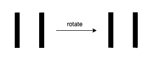

## 数组/字符串

### [624. 数组列表中的最大距离](https://leetcode.cn/problems/maximum-distance-in-arrays/)

```python
class Solution:
    def maxDistance(self, arrays: List[List[int]]) -> int:
        ans = 0
        mn, mx = inf, -inf
        for a in arrays:
            ans = max(ans, a[-1] - mn, mx - a[0])
            mn = min(mn, a[0])
            mx = max(mx, a[-1])
        return ans
```

可以用递推的思路理解

### [280. 摆动排序](https://leetcode.cn/problems/wiggle-sort/)

给你一个的整数数组 `nums`, 将该数组重新排序后使 `nums[0] <= nums[1] >= nums[2] <= nums[3]...`

输入数组总是有一个有效的答案。

**示例 1:**

```
输入：nums = [3,5,2,1,6,4]
输出：[3,5,1,6,2,4]
解释：[1,6,2,5,3,4]也是有效的答案
```

**示例 2:**

```
输入：nums = [6,6,5,6,3,8]
输出：[6,6,5,6,3,8]
```

**提示：**

- `1 <= nums.length <= 5 * 104`
- `0 <= nums[i] <= 104`
- 输入的 `nums` 保证至少有一个答案。


**进阶：**你能在 `O(n)` 时间复杂度下解决这个问题吗？

```python
class Solution:
    def wiggleSort(self, nums: List[int]) -> None:
        nums.sort()
        for i in range(1, len(nums) - 1, 2):
            nums[i], nums[i + 1] = nums[i + 1], nums[i]
```

贪心做法（需要仔细观察过程）：

```python
class Solution:
    def wiggleSort(self, nums: List[int]) -> None:
        for i in range(len(nums) - 1):
            if ((i % 2 == 0 and nums[i] > nums[i + 1]) or
                (i % 2 == 1 and nums[i] < nums[i + 1])):
                nums[i], nums[i + 1] = nums[i + 1], nums[i]

```


### [1056. 易混淆数](https://leetcode.cn/problems/confusing-number/)

给定一个数字 `N`，当它满足以下条件的时候返回 `true`：

原数字旋转 180° 以后可以得到新的数字。

如 0, 1, 6, 8, 9 旋转 180° 以后，得到了新的数字 0, 1, 9, 8, 6 。

2, 3, 4, 5, 7 旋转 180° 后，得到的**不是**数字。

易混淆数 (confusing number) 在旋转180°以后，可以得到和原来**不同**的数，且新数字的每一位都是有效的。


**示例 1：**


```
输入：6
输出：true
解释：
把 6 旋转 180° 以后得到 9，9 是有效数字且 9!=6 。
```

**示例 2：**


```
输入：89
输出：true
解释:
把 89 旋转 180° 以后得到 68，68 是有效数字且 89!=68 。
```

**示例 3：**



```
输入：11
输出：false
解释：
把 11 旋转 180° 以后得到 11，11 是有效数字但是值保持不变，所以 11 不是易混淆数字。
```

**示例 4：**


```
输入：25
输出：false
解释：
把 25 旋转 180° 以后得到的不是数字。
```

**提示：**

1. `0 <= N <= 10^9`
2. 可以忽略掉旋转后得到的前导零，例如，如果我们旋转后得到 `0008` 那么该数字就是 `8` 。'

翻转是旋转的意思！！！

```python
class Solution:
    def confusingNumber(self, n: int) -> bool:
        num = []
        num_map = {'6': '9', '9': '6'}
        for i in str(n):
            if int(i) in [6, 9]:
                num.append(num_map[i])
            elif int(i) in [2, 3, 4, 5, 7]:
                return False
            else:
                num.append(i)
        if int("".join(reversed(num))) == n:
            return False
        return True
```

### [1427. 字符串的左右移](https://leetcode.cn/problems/perform-string-shifts/)

### [161. 相隔为 1 的编辑距离](https://leetcode.cn/problems/one-edit-distance/)

### [186. 反转字符串中的单词 II](https://leetcode.cn/problems/reverse-words-in-a-string-ii/)

### [1055. 形成字符串的最短路径](https://leetcode.cn/problems/shortest-way-to-form-string/)

## 滑动窗口

##  哈希

---

## 设计

## 回溯

## 动态规划

### [276. 栅栏涂色](https://leetcode.cn/problems/paint-fence/)

有 `k` 种颜色的涂料和一个包含 `n` 个栅栏柱的栅栏，请你按下述规则为栅栏设计涂色方案：

- 每个栅栏柱可以用其中 **一种** 颜色进行上色。
- 相邻的栅栏柱 **最多连续两个** 颜色相同。

给你两个整数 `k` 和 `n` ，返回所有有效的涂色 **方案数** 。

**示例 1：**


```
输入：n = 3, k = 2
输出：6
解释：所有的可能涂色方案如上图所示。注意，全涂红或者全涂绿的方案属于无效方案，因为相邻的栅栏柱 最多连续两个 颜色相同。
```

**示例 2：**

```
输入：n = 1, k = 1
输出：1
```

**示例 3：**

```
输入：n = 7, k = 2
输出：42
```

**提示：**

- `1 <= n <= 50`
- `1 <= k <= 105`
- 题目数据保证：对于输入的 `n` 和 `k` ，其答案在范围 `[0, 231 - 1]` 内

```python
class Solution:
    def numWays(self, n: int, k: int) -> int:
        if k == 1 and n <= 2:
            return 1
        elif k == 1:
            return 0
        elif n == 1:
            return k

        @cache
        def dp(n, used):
            if n == 1 and used:
                return k - 1
            elif n == 1 and not used:
                return k
            if used:
                return (k - 1) * dp(n - 1, False)
            else:
                return dp(n - 1, True) + (k - 1) * dp(n - 1, False)


        return k * dp(n - 1, False)

```

todo：更好的动态规划方法


### [256. 粉刷房子](https://leetcode.cn/problems/paint-house/)

假如有一排房子，共 `n` 个，每个房子可以被粉刷成红色、蓝色或者绿色这三种颜色中的一种，你需要粉刷所有的房子并且使其相邻的两个房子颜色不能相同。

当然，因为市场上不同颜色油漆的价格不同，所以房子粉刷成不同颜色的花费成本也是不同的。每个房子粉刷成不同颜色的花费是以一个 `n x 3` 的正整数矩阵 `costs` 来表示的。

例如，`costs[0][0]` 表示第 0 号房子粉刷成红色的成本花费；`costs[1][2]` 表示第 1 号房子粉刷成绿色的花费，以此类推。

请计算出粉刷完所有房子最少的花费成本。

**示例 1：**

```
输入: costs = [[17,2,17],[16,16,5],[14,3,19]]
输出: 10
解释: 将 0 号房子粉刷成蓝色，1 号房子粉刷成绿色，2 号房子粉刷成蓝色。
     最少花费: 2 + 5 + 3 = 10。
```

**示例 2：**

```
输入: costs = [[7,6,2]]
输出: 2
```

**提示:**

- `costs.length == n`
- `costs[i].length == 3`
- `1 <= n <= 100`
- `1 <= costs[i][j] <= 20`

```python
class Solution:
    def minCost(self, costs: List[List[int]]) -> int:
        @cache
        def dp(i, used):
            if i == -1:
                return 0
            min_cost = inf
            for j in range(3):
                if j != used:
                    min_cost = min(min_cost, costs[i][j] + dp(i - 1, j))
            return min_cost
        return dp(len(costs) - 1, -1)

```


### [265. 粉刷房子 II](https://leetcode.cn/problems/paint-house-ii/)

假如有一排房子共有 `n` 幢，每个房子可以被粉刷成 `k` 种颜色中的一种。房子粉刷成不同颜色的花费成本也是不同的。你需要粉刷所有的房子并且使其相邻的两个房子颜色不能相同。

每个房子粉刷成不同颜色的花费以一个 `n x k` 的矩阵表示。

- 例如，`costs[0][0]` 表示第 `0` 幢房子粉刷成 `0` 号颜色的成本；`costs[1][2]` 表示第 `1` 幢房子粉刷成 `2` 号颜色的成本，以此类推。

返回 *粉刷完所有房子的最低成本* 。

**示例 1：**

```
输入: costs = [[1,5,3],[2,9,4]]
输出: 5
解释:
将房子 0 刷成 0 号颜色，房子 1 刷成 2 号颜色。花费: 1 + 4 = 5;
或者将 房子 0 刷成 2 号颜色，房子 1 刷成 0 号颜色。花费: 3 + 2 = 5.
```

**示例 \**2:\****

```
输入: costs = [[1,3],[2,4]]
输出: 5
```

**提示：**

- `costs.length == n`
- `costs[i].length == k`
- `1 <= n <= 100`
- `2 <= k <= 20`
- `1 <= costs[i][j] <= 20`

**进阶：**您能否在 `O(nk)` 的时间复杂度下解决此问题？

```python
class Solution:
    def minCostII(self, costs: List[List[int]]) -> int:
        @cache
        def dp(i, used):
            if i == -1:
                return 0
            min_cost = inf
            for j in range(len(costs[0])):
                if j != used:
                    min_cost = min(min_cost, costs[i][j] + dp(i - 1, j))
            return min_cost
        return dp(len(costs) - 1, -1)

```

### [651. 四个键的键盘](https://leetcode.cn/problems/4-keys-keyboard/)

假设你有一个特殊的键盘包含下面的按键：

- `A`：在屏幕上打印一个 `'A'`。
- `Ctrl-A`：选中整个屏幕。
- `Ctrl-C`：复制选中区域到缓冲区。
- `Ctrl-V`：将缓冲区内容输出到上次输入的结束位置，并显示在屏幕上。

现在，*你可以 **最多** 按键 `n` 次（使用上述四种按键），返回屏幕上最多可以显示 `'A'` 的个数* 。


**示例 1:**

```
输入: n = 3
输出: 3
解释:
我们最多可以在屏幕上显示三个'A'通过如下顺序按键：
A, A, A
```

**示例 2:**

```
输入: n = 7
输出: 9
解释:
我们最多可以在屏幕上显示九个'A'通过如下顺序按键：
A, A, A, Ctrl A, Ctrl C, Ctrl V, Ctrl V
```


**提示:**

- `1 <= n <= 50`

**关键是找出最后一步可能的前继**

```py
class Solution:
    def maxA(self, n: int) -> int:
        best = [0, 1]
        for k in range(2, n+1):
            best.append(max(best[x] * (k - x - 1) for x in range(k - 1)))
            best[-1] = max(best[-1], best[-2] + 1)
        return best[n]
```
