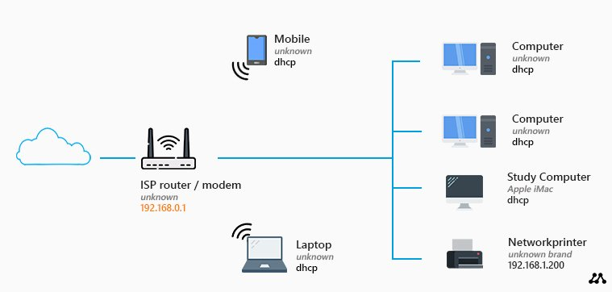
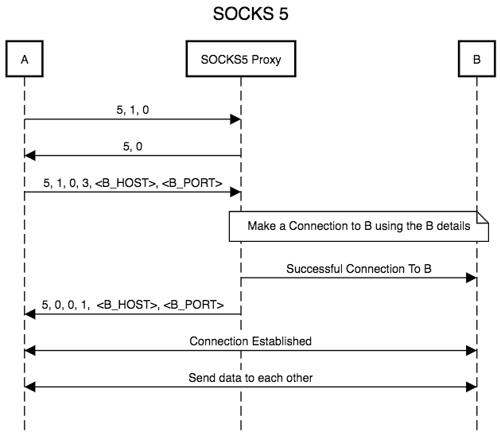
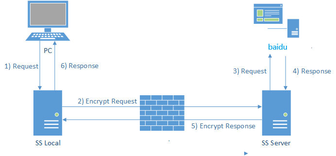
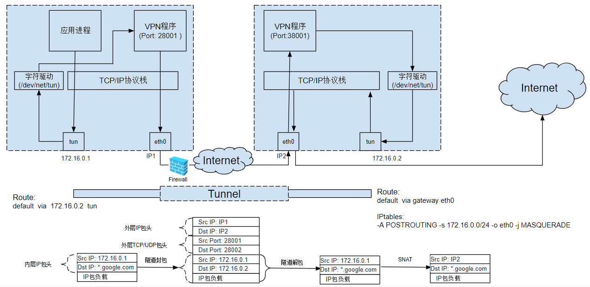

查看本文配套的 slide [点这里](/slides/proxy)

---

大家好，今天我分享的主题是「打破壁垒：代理技术在家庭网络中的应用」。主要是向大家介绍，假如在家庭网络中，有黑客挟持了网关，并对正常访问互联网产生了干扰，我们如何通过代理技术来突破封锁，打破壁垒，正常地访问互联网。

# 运行良好的家庭网络 

首先我们来复习一下在一个运行良好的家庭网络中，用户是如何访问互联网，以及网关在其中起到了什么作用的。

上图是一个最简化的家庭网络的基本架构。ISP，也就是互联网服务提供商向你提供一个内置光猫的路由器。光猫把光缆中的光信号转化为路由器能够解析的电信号。路由器是在网络层进行路由转发的设备，往往也是一个通用计算机。路由器也往往充当了无线局域网络Wi-Fi的AP，接入点。

我们的设备在连接到Wi-Fi时，就相当于接入到了这个这个无限局域网。具有Wi-Fi功能的路由器一般也充当了dhcp服务器的角色。dhcp服务器在局域网中广播告知自己的存在，当设备检测到后就向dhcp服务器请求分配IP。dhcp不仅仅会告知设备自己被分配的IP，还会告知设备当前网段的子网掩码以及网关IP地址。在此之后，用户所有的网络报文都会被转发给网关，然后经由网关再转发给真正的目标。网关也往往是由这里的路由器担任。

# 黑客、襲来

鉴于路由器“一夫当关，万夫莫开”的地位，它很容易成为被攻击的对象。假设我们处于一个合租房里，黑客阿至是我们的房主。阿至是一个狂热的百度厌恶者，他千方百计地阻止别人访问百度，甚至不惜对路由器偷偷做手脚，以使得租客无法访问百度。

由于家中地路由器就是一个通用计算机，阿至通过刷机的方式掌握了这台路由器的root权限，从此他就可以对路由器胡作非为了。他把这台路由器刷成了Linux的系统，并输入了下面命令：

`iptables -A OUTPUT -d baidu.com -j DROP`

`iptables -A INPUT -s baidu.com -j DROP`

下面两条命令会使路由器拒绝一切由百度发送而来，或者发向百度的报文。iptables是一个运行在linux用户态的工具，但他可以对内核网络栈的处理规则进行配置。具体而言，用户可以通过它来为内核添加一些hook函数，内核会在处理网络报文时调用这些hook函数，并根据结果对报文进行一些处理。比如第一条命令，iptables 会首先通过DNS查询获得baidu.com的IP地址，然后在一个网络层报文经过内核栈处理并发送之前，判断该报文的目标是否是baidu.com，如果是，则直接丢弃该报文。第二条命令做的也是类似的事情，他会丢弃从baidu.com发来的报文。

这样阿至就成功地阻止了我们访问baidu.com。

# 代理服务器

在阿至对路由器做了手脚后，我们就不能再访问百度了。但是百度之外的网站却又可以正常访问，所以我们很快就猜到阿至做了什么。我们可不会向黑客屈服的！如果除百度之外的网站都可以访问...那么只要我们在外网上还有一台服务器，通过这台服务器的中转来访问百度，这样经过路由器报文的源IP和目的IP都会变成服务器IP而不是百度IP了，这样我们就能正常访问百度了！

经过百度查询之后，我们发现了[socks5代理](https://datatracker.ietf.org/doc/html/rfc1928)这一应用层协议。在这个协议中，用户程序需要和目标通过TCP/UDP协议通信时，可以先通过socks5协议与实现了该协议的代理服务器通信，然后代理服务器再和目标通信，将返回报文转发给用户程序。HTTP/HTTPS协议起到的作用与socks5协议类似。大多数使用网络的用户程序都实现了该协议，比如 `curl`，大部分浏览器 他们会在发送网络请求时先查看环境变量中是否定义了 `http_proxy socks_proxy` 等，如果定义了，则通过代理服务器与目标通信，否则直接通信。但也有一些用户程序，比如 `wget`，并不会主动检查并使用用户定义的代理。

所以，我们只要使用代理服务器，就可以绕开阿至的封锁了！

# 黑客、侵入

不过经过一段时间后，阿至发现我们经过路由器的报文总是发向同一个地址，他很快就猜到我们是使用了代理服务器来绕开路由器的封锁。他对经过路由器转发的数据包分析后发现，许多包中都存在 baidu 这样的字段...

于是阿至又想到了一个点子，他在路由器中输入了如下命令：

`iptables -I INPUT -m string --string "/baidu/i" --algo regex -j DROP`

这样，只要报文中含有 “baidu” 这个字符串，就会被路由器丢弃，宁可错杀一百，不可放过一个！

# 加密的代理

不久后，我们也发现baidu又不能正常访问了，甚至用bing搜索“baidu”都不行，似乎只要含有“baidu”这个关键词，报文就会被丢弃。于是我们想出了一个办法：既然你做关键词匹配，那么只要我的报文里没有关键词就好了。如果经过路由器的报文都是经过加密的，阿至肯定就不知道我们报文的真实内容是什么了，他也不至于和我们彻底闹翻，丢掉所有报文，不让我们连接互联网吧。

我们首先想到的是，对socks5代理进行增强，让应用程序与代理服务之间进行加密通话。可是市场上的应用程序基本都只实现了简单的socks5代理，如果要让他们支持加密功能则需要把他们的源代码都改了，这个工作量可太大了！

经过思考，我们想到可以利用已有的socks5代理协议，在此基础上实现自己的加密版本。我们写了一个socks5代理服务器SS Local，local接收应用程序的代理请求，可是local不运行在外网，而是运行在内网，它会把应用程序发送给他的报文先加密，然后发送给外网的另一个socks5服务器SS Server，server会解密报文，得到真正需要代理的请求。当请求返回时server也会先把报文加密，发送给local，local把报文解密，再发送给用户程序。

这样，尽管用户程序以为自己还在使用普通的socks5代理，可是我们已经悄悄对socks5协议进行了升级，实际上经过路由器的报文都是加密过的了，阿至再也无法知道我们在看些什么了！

# 透明的代理

虽然我们已经战胜了阿至，做到了几乎完美的加密，但我们还不满足于此。

上面的代理得要用户程序主动使用，有没有可能实现透明的代理方法，让所有网络报文都经过代理？

答案是有的。只要通过新建[虚拟网卡](https://gist.github.com/mtds/4c4925c2aa022130e4b7c538fdd5a89f)，把通过其中的报文都代理了就好了...

VPN的原理就是这样...

# 漫无止境的战斗

不过，网络封锁与突破，将永远是一场漫无止境的战斗。

+ 事实上阿至还可以
  + 做 DNS 污染，
  + 识别加密数据规律
  + 主动嗅探...
+ 但同时，兵来将挡，水来土掩，我们也永远有新的突破网络封锁的方式
+ "猫鼠游戏"永远不会完结

# 总结

| 黑客的手段 | 我们的举措 |
| ---------- | ---------- |
| ip审查     | 代理       |
| 内容审查   | 加密代理   |
| 流量规律   | 换加密方式 |
| 主动嗅探   | 更好的伪装 |

 	

​    

​    
