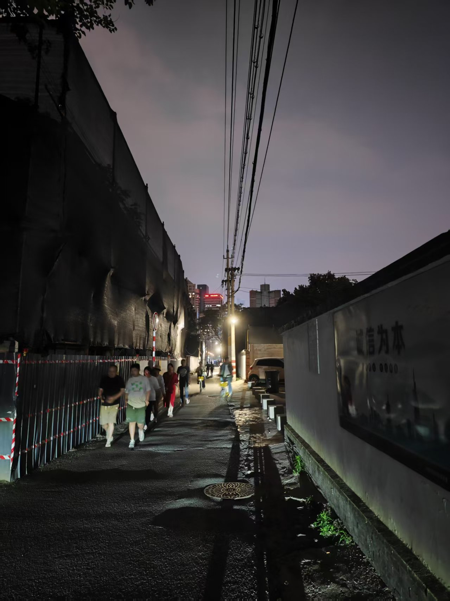

「どうしても負けたくない」

私はそう自分に言い聞かせた。なぜなら、負けることは死を意味したからだ。

犬に出会った時、もし弱気を見せれば、すぐに「ワンワン」と吠えられ、追いかけられた。怖がっている時に、犬には何か嗅ぎつけられるような気配があるように感じたのだ。

犬だけでなく、人間も同じだ。どうしても負けたくない。これはまるでラクダのような感情だ。死ぬまでひたすら重いものを背負い続ける。

しかし、時には「つまらないな！」と思うこともあった。何かをやりかけている途中で投げ出し、虚無感を覚えることも。

こんなことに何の意味もない！欲望なんてどうせ短いものだ。誰もがいつか死を迎える。これはまるでライオンのような感情かもしれない。全てを破壊したい。

そんな時、「もし、彼・彼女に会ったら、きっと」とふと思った。彼女と会うことを想像した時、まだ動力が湧き上がってくるのを感じた。

たとえ意味がなくても、ゲームのようにプレイすることはできる。

面白さを探し求めていけばいい。私はまだ、子供なのだ。
